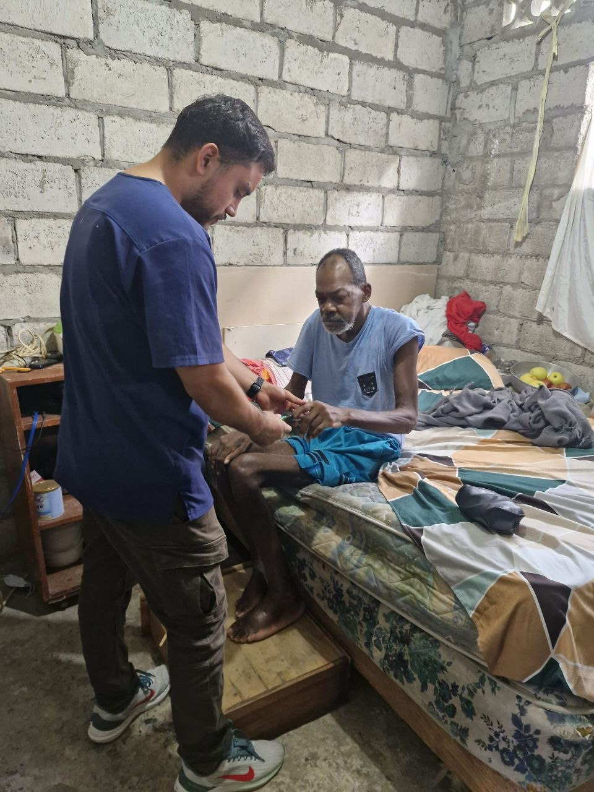

## ¿Qué es un médico social?

El médico social es un profesional de la salud que entiende que la enfermedad no solo se cura con medicamentos. Su mirada va más allá del consultorio: observa las condiciones de vida, el entorno familiar, el acceso a servicios básicos y los determinantes sociales que afectan la salud de las personas.

## Su papel en la comunidad

A diferencia del médico tradicional, el médico social trabaja **en y con la comunidad**. No espera a que los pacientes lleguen a su consulta, sino que sale a buscar los problemas donde ocurren. Su herramienta principal no es el estetoscopio, sino la **escucha activa** y el **trabajo en equipo** con otros profesionales.

## Los pilares de su trabajo

1. **Prevención**: Antes que curar, prevenir.
2. **Educación**: Enseñar a la comunidad a cuidar su salud.
3. **Equidad**: Luchar por el acceso universal a la salud.
4. **Interdisciplina**: Trabajar con sociólogos, psicólogos, educadores y líderes comunitarios.

## Reflexión final

Ser médico social no es una especialidad más. Es una **forma de ver el mundo** y entender que la salud es un derecho, no un privilegio. Es reconocer que detrás de cada paciente hay una historia, una familia y una comunidad que también necesitan ser sanadas.

---

*Este es mi primer artículo. ¡Gracias por leerme!*
